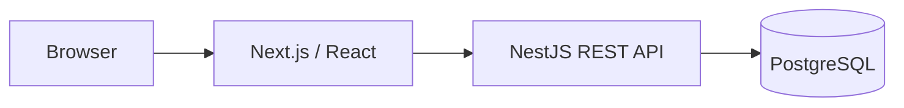
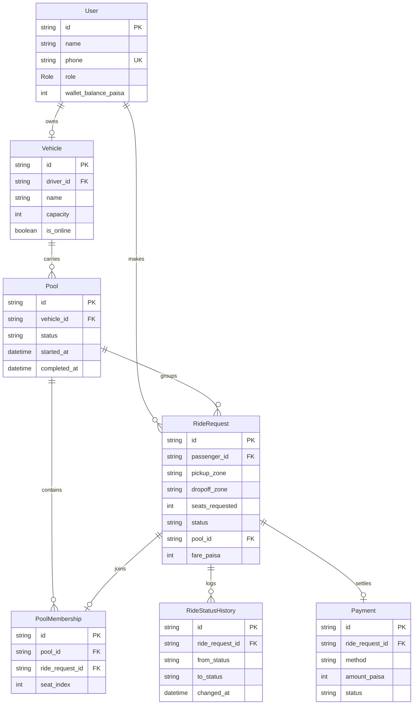

# Dhaka-Tesla-Pool

A ride-pooling platform for Tesla owners and passengers in Dhaka.

Dhaka-Tesla-Pool connects passengers traveling along compatible routes so they can **share Tesla rides, reduce individual travel costs, and make better use of available vehicle capacity**. Drivers can make their vehicles available for pooled rides, while passengers can request rides, select destinations, and track the ride through completion.

## Links

* **Live App:** [Click Here](https://dhaka-tesla-pool-web-tvy7.onrender.com/)
* **Demo Video:** https://example.com

## App Preview

### Driver - Accepting Rides

The driver can switch their vehicle status from **Offline** to **Online - Accepting Rides**.


### Passenger - Requesting and Completing a Ride

The passenger flow covers **signing in, selecting a destination, requesting a ride, and completing the ride**.


## Architecture



The API owns authentication, validation, ride lifecycle, pooling, fare calculation, and data-consistency rules.

Detailed architecture and request flows: [`docs/architecture.md`](docs/architecture.md)

## Database / ERD



Detailed schema, relationships, constraints and indexes: [`docs/database-schema.md`](docs/database-schema.md)

## Getting Started

### Windows

Run the following commands from the project root:

```powershell
.\console\root.ps1
.\console\backend.ps1
.\console\frontend.ps1
```

> **PowerShell execution policy:** If Windows blocks the scripts because they are not digitally signed, unblock the repository's PowerShell scripts first:
>
> ```powershell
> Get-ChildItem -Path .\console -Filter *.ps1 -Recurse | Unblock-File
> ```
>
> Then run the commands above again.

### Linux / macOS

Make the scripts executable first:

```bash
chmod +x console/*.sh
```

Then run:

```bash
./console/root.sh
./console/backend.sh
./console/frontend.sh
```

### Docker

The complete application can also be started with:

```bash
docker compose up --build
```

This starts the frontend, backend and PostgreSQL services, applies database migrations, and loads the seed data.

| Service  | URL                          |
| -------- | ---------------------------- |
| Frontend | http://localhost:3000        |
| API      | http://localhost:3001        |
| API base | http://localhost:3001/api/v1 |

## Prerequisites

* Docker + Docker Compose
* Node.js 20+
* npm

For configuration, copy `.env.example` to `.env` and provide local values. **Never commit real secrets.**

## Demo Credentials

The seed data uses the assignment's story cast:

| User   | Role      | Phone         | Password      |
| ------ | --------- | ------------- | ------------- |
| Jashim | Driver    | `01700000000` | `password123` |
| Nusrat | Passenger | `01700000001` | `password123` |
| Rafiq  | Passenger | `01700000002` | `password123` |
| Shirin | Passenger | `01700000003` | `password123` |

Jashim owns **Bullet**, the MVP's three-seat vehicle.

## Core Features

* Passenger sign-up/sign-in
* Driver sign-in and online/offline status
* Ride requests with pickup, destination and seats
* Predefined Dhaka zones
* Compatible-route pooling
* Three-seat vehicle capacity enforcement
* Individual passenger fares
* Pooled-fare recalculation
* Ride/pool lifecycle management
* Passenger cancellation
* Driver arrival, start and completion
* Ride status history
* Cash/simulated payment records
* Role-based authorization
* PostgreSQL persistence
* Docker Compose environment
* Seed/demo data
* Automated backend tests and CI

## Ride Lifecycle

```text
REQUESTED
    ├──→ CANCELLED
    ↓
MATCHED
    ├──→ CANCELLED
    ↓
DRIVER_ARRIVED
    ↓
STARTED
    ↓
COMPLETED
```

Invalid state transitions are rejected by the backend.

## Fare Model

```text
passengerFare =
    baseFare + distanceCharge - poolDiscount
```

Current model:

* Base fare: **৳30**
* Distance charge: **৳15/km**
* Pool discount: **20%**
* Money stored as integer **paisa**

Distance is calculated from the predefined zone coordinates rather than a live routing API.

Detailed geography, matching and fare rules: [`docs/specs.md`](docs/specs.md)

## Testing

Run the backend tests:

```bash
cd backend
npm test
```

Build the backend:

```bash
npm run build
```

Tests cover the high-risk business rules, including:

* Vehicle/pool capacity cannot be exceeded
* Competing last-seat claims are handled consistently
* Invalid ride-state transitions are rejected
* Nusrat/Rafiq pooled fares are calculated correctly
* Existing pool members receive the recalculated pooled fare
* Pickup and drop-off compatibility is enforced
* Passengers cannot modify another passenger's ride
* Cancellation rules are enforced
* Cancelled pool members do not block completion

CI runs the backend test suite through GitHub Actions.

## API

Base path:

```text
/api/v1
```

Main resources:

```text
POST   /auth/signup
POST   /auth/signin

POST   /rides
GET    /rides/me
GET    /rides/available
GET    /rides/:id
PATCH  /rides/:id/cancel

POST   /pools/:rideRequestId/accept
PATCH  /pools/:id/driver-arrived
PATCH  /pools/:id/start
PATCH  /pools/:id/complete
```

Complete request/response contracts: [`docs/api-contracts.md`](docs/api-contracts.md)

## Key Decisions

* **PostgreSQL:** relational transactions and row-level locking fit pooling and capacity enforcement.
* **NestJS:** structured modules, dependency injection, guards and validation without unnecessary distributed infrastructure.
* **Predefined Dhaka zones:** deterministic matching and fare calculation without depending on paid/external routing APIs.
* **Integer paisa:** avoids floating-point money calculations.
* **Database locking:** handles the MVP's concurrent last-seat problem without adding Redis or a queue.
* **Single-driver MVP:** keeps the scope focused on pooling, lifecycle and consistency rather than dispatch.

Technology alternatives and detailed trade-offs: [`docs/tech-stack.md`](docs/tech-stack.md)

## Concurrency

Pool acceptance is protected by a PostgreSQL transaction. When an existing pool is being modified, its row is locked before capacity and compatibility are re-evaluated.

Therefore, two requests competing for the final seat cannot both successfully consume it.

The current design is intentionally sufficient for the single-driver MVP; scaling to many drivers would require additional matching, contention management and infrastructure.

## Known Limitations

* No live map/routing integration
* No live driver GPS tracking
* No real payment gateway
* No multi-driver dispatch system
* Wallet top-up is simulated for the frontend demo
* No production deployment is currently configured

Potential scaling and production improvements are documented in [`docs/architecture.md`](docs/architecture.md).

## Project Structure

```text
.
├── backend/
│   ├── prisma/
│   └── src/
├── frontend/
├── console/
├── docs/
├── assets/
├── docker-compose.yml
└── .github/
    └── workflows/
```

## AI Usage

AI tools were used openly as part of the engineering workflow.

**Tools used:**

* **Claude Sonnet 5.5**
* **GPT-5.6 Luna**

**Used for:**

* Code generation and implementation
* Debugging
* Test development/review
* Architecture and implementation review
* Documentation and README writing
* Docker/CI configuration review

## Deployment

**Live App:** https://example.com

The deployment link above is a placeholder and will be replaced with the final public deployment URL.

## Demo Video

**Maximum 6-minute walkthrough:** https://example.com

The final video covers:

1. Problem and product understanding
2. Architecture and ERD
3. Backend, frontend and database implementation
4. Ride/pool lifecycle
5. Passenger and driver flows
6. Pooling and fare calculation
7. An edge case/concurrency scenario
8. Deployment/demo

## Documentation

* [`docs/architecture.md`](docs/architecture.md) - architecture and system flows
* [`docs/database-schema.md`](docs/database-schema.md) - database design and ERD
* [`docs/specs.md`](docs/specs.md) - product rules, geography, fares and concurrency
* [`docs/api-contracts.md`](docs/api-contracts.md) - API contracts
* [`docs/tech-stack.md`](docs/tech-stack.md) - technology choices and trade-offs
