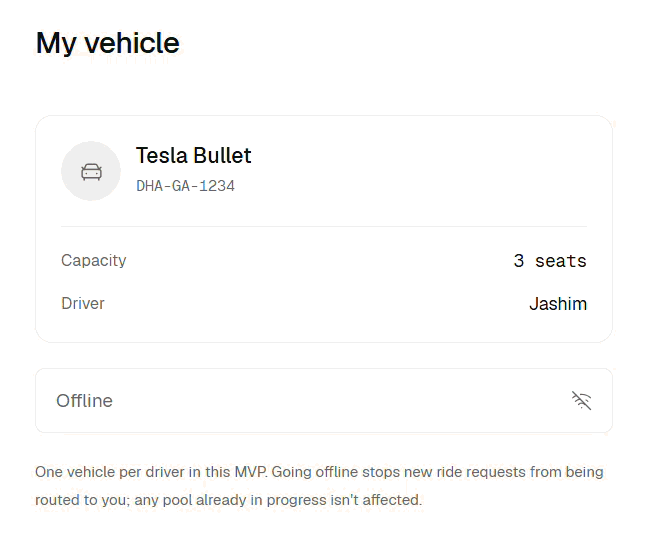
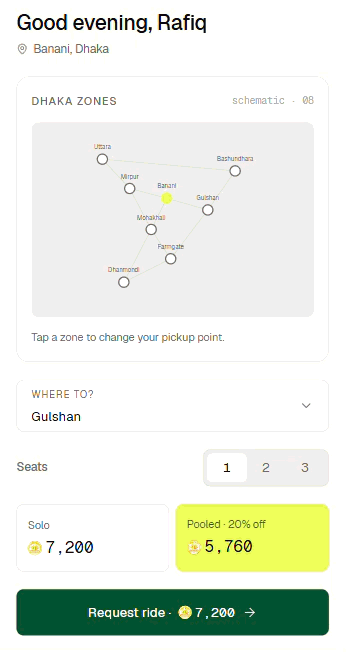

# Dhaka-Tesla-Pool

A ride-pooling platform for Tesla owners and passengers in Dhaka.

Dhaka-Tesla-Pool connects passengers traveling along compatible routes so they can **share Tesla rides, reduce individual travel costs, and make better use of available vehicle capacity**. Drivers can make their vehicles available for pooled rides, while passengers can request rides, select destinations, and track the ride through completion.

## App Preview

### Driver - Accepting Rides

The driver can switch their vehicle status from **Offline** to **Online — Accepting Rides**.



### Passenger - Requesting and Completing a Ride

The passenger flow covers **signing in, selecting a destination, requesting a ride, and completing the ride**.



## Getting Started

### Windows

Run the following commands from the project root:

```powershell
.\console\root.ps1
.\console\backend.ps1
.\console\frontend.ps1
```

### Linux / macOS

Make the scripts executable first:

```bash
chmod +x console/*.sh
```

Then run:

```bash
./console/root.sh
./console/backend.sh
./console/frontend.sh
```

More screenshots and GIFs demonstrating the application's features will be added here.
