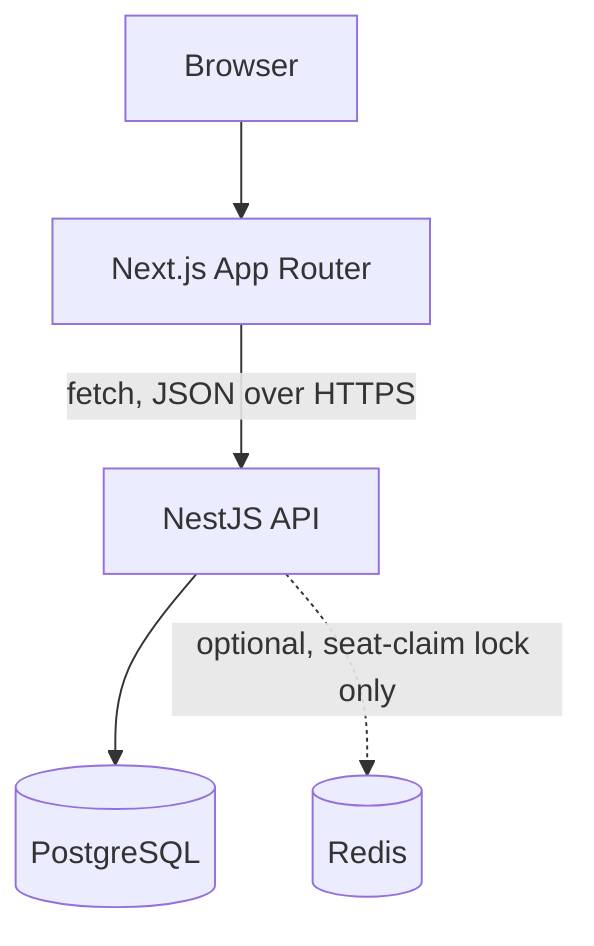

# Architecture

## High-level diagram



No queues, no Kafka, no microservices. Redis, if used at all, exists solely to serialize the last-seat concurrency check described in `specs.md`. Everything else is a single Node process talking to a single Postgres instance.

## Layered structure inside the API

```
Controller  -> validates input shape (DTO), calls a service, returns response
Service     -> business logic, the only place state transitions happen
Repository  -> Prisma client calls, no business logic
```

A controller never talks to Prisma directly. A service never builds an HTTP response. This split is what makes "explain this endpoint" a three-sentence answer instead of a scroll through one giant file.

## The three swap points

These are the parts of the system explicitly designed to be replaced later with minimum refactoring, each is a single module with a narrow interface:

| Module | MVP implementation | Real-world replacement | What changes when you swap |
|---|---|---|---|
| `geo/geo.service.ts` | Static Dhaka zone list, haversine distance | Google Maps Distance Matrix API | Only the inside of `geo.service.ts`. Callers keep using `distanceKm(a, b)` |
| `fare/fare.service.ts` | Fixed formula (base + distance - pool discount) | Dynamic/surge pricing engine | Only the inside of `calculateFare()`. Callers keep passing the same request shape |
| `payments/payment.service.ts` | Cash or simulated TeslaPay wallet | Stripe, bKash, Nagad, etc. | Only the inside of `charge()`. Callers keep the same method signature |

If an interviewer asks "connect this to a live API," the answer is: open the one file for that concern, keep the function signature, replace the body. No controller, DTO, or database schema needs to change.

## Request flow example: Nusrat requests a ride

1. `POST /rides` hits `RidesController`, DTO validates pickup/dropoff/seats.
2. `RidesService.create()` calls `GeoService.distanceKm()` for the fare estimate and `FareService.calculateFare()` to compute the quoted fare.
3. `RidesService` writes a `RideRequest` row with status `REQUESTED` and a `RideStatusHistory` entry.
4. Response returns the ride id, estimated fare, and status to the passenger.

Matching into a pool happens later, asynchronously from the passenger's point of view, when the driver's app or a matching job evaluates open `REQUESTED` rides against `zones.data.ts` adjacency rules (see `specs.md`).


> No adding infrastructure to look advanced. Every component in this diagram earns its place by solving a stated requirement (pooling, capacity, persistence, state history). Nothing is here for demo polish.
