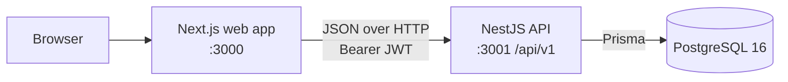
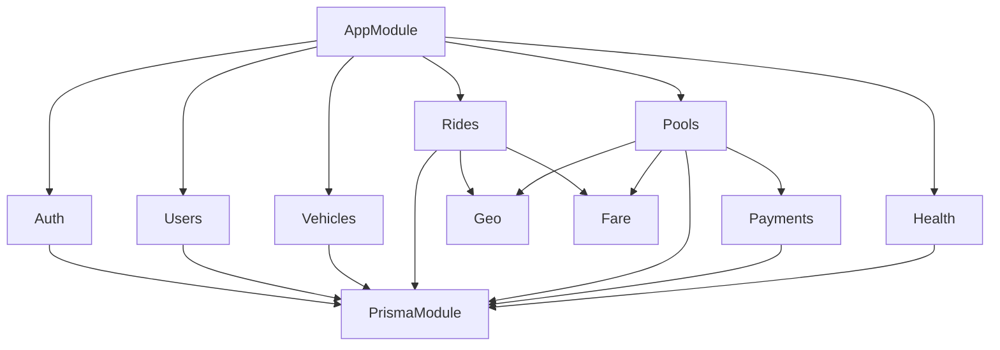
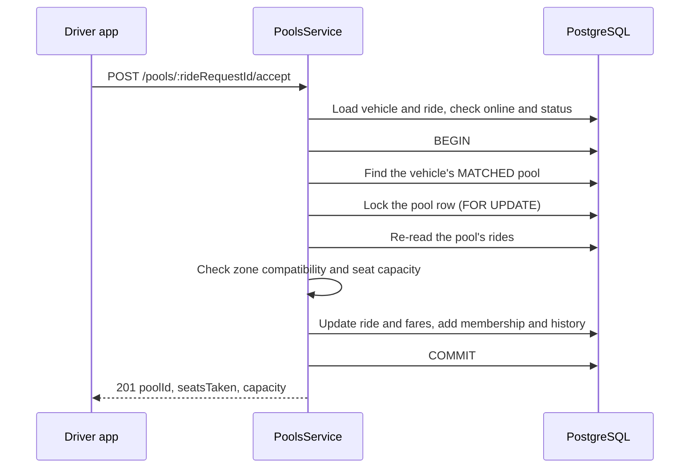

# Architecture

Dhaka Tesla Pool is three moving parts: a Next.js web app, a NestJS API and a PostgreSQL database. The API is the only component that holds business rules and the only one that talks to the database. There is no cache, message queue or other service in between.


```mermaid
flowchart LR
    Browser["Browser"] --> Web["Next.js web app<br/>:3000"]
    Web -->|"JSON over HTTP<br/>Bearer JWT"| API["NestJS API<br/>:3001 /api/v1"]
    API -->|"Prisma"| DB[("PostgreSQL 16")]
```

Docker Compose runs all three as separate containers. The rules the API enforces are described in [specs.md](specs.md), the endpoints in [api-contracts.md](api-contracts.md), and the tables in [database-schema.md](database-schema.md).

## Backend structure

Each request passes through three layers:

```
Controller  ->  validates the request body (DTO), checks the role, calls a service
Service     ->  business rules, the only place a status changes
PrismaService  ->  database access
```

There is no separate repository layer. Services call `PrismaService` directly, which keeps a small codebase easy to follow. The rules that keep the layers honest:

- A controller never contains business rules or talks to Prisma. It validates input and delegates.
- A service never builds an HTTP response. It returns plain objects, and it never returns a password hash.
- Every status change goes through `assertTransition()` in `common/status-machine.ts`, never a hand written `if` chain.
- Money is an integer number of paisa everywhere, and variable names carry a `Paisa` suffix.

### Modules


```mermaid
flowchart TD
    App["AppModule"] --> Auth & Users & Vehicles & Rides & Pools & Health
    Rides --> Geo & Fare
    Pools --> Geo & Fare & Payments
    Auth & Users & Vehicles & Rides & Pools & Payments & Health --> Prisma["PrismaModule"]
```

| Module | Responsibility |
|---|---|
| `auth` | Sign up, sign in, JWT issuing and verification, and the roles guard. |
| `users` | The signed in user's own profile. |
| `vehicles` | A driver's own vehicle and whether it is online. |
| `rides` | A passenger's requests: create, list, view and cancel. Also the list of rides waiting for a driver. |
| `pools` | Driver side work: accepting rides into a pool, moving the pool through its lifecycle, enforcing seat capacity, and returning the driver's active pool. |
| `fare` | Turns a distance into a fare in paisa. |
| `geo` | Distance between two points, and whether two zones are compatible for pooling. |
| `payments` | Records a payment. It has no HTTP routes and is only called by `pools`. |
| `health` | A liveness endpoint that also checks the database. |
| `common` | Prisma access, the status machine, money helpers and the global error filter. |

### Cross-cutting behaviour

Set up once, in `main.ts` and `app.module.ts`, and applied to every route:

- **Prefix:** all routes live under `/api/v1`.
- **Validation:** a global validation pipe turns DTO rules on, strips undeclared fields and rejects unknown ones with `400`.
- **Errors:** one global filter formats every error the same way. It maps known database errors to clean `409` and `404` responses and never sends internal details to the client. Unexpected failures are logged on the server and returned as a plain `500`.
- **Authentication:** a JWT strategy reads the Bearer token and a roles guard checks the `PASSENGER` or `DRIVER` role.
- **CORS:** only the origins listed in `CORS_ORIGIN` may call the API from a browser.
- **Configuration:** environment variables are validated when the API starts, so a missing setting fails at boot, not on the first request.

## The three swap points

Three concerns are built to be replaced with as little change as possible. Each is a single module that the rest of the code reaches through a small set of methods.

| Module | Today | A realistic replacement | What changes |
|---|---|---|---|
| `geo/geo.service.ts` | Fixed zone table, haversine distance and adjacency rules | A routing provider such as the Google Maps Distance Matrix API | The bodies of `distanceKm()`, `pickupZonesCompatible()` and `dropoffZonesCompatible()`. Callers keep the same three methods. |
| `fare/fare.service.ts` | One fixed formula with a 20% pool discount | A dynamic or surge pricing engine | The body of `calculateFare(distanceKm, pooled)`. Inputs such as time of day would extend its parameters. |
| `payments/payments.service.ts` | Records an immediately completed cash payment | A gateway such as bKash, Nagad or Stripe | The body of `charge()`. Today `PoolsService.complete()` always passes the method `cash`, so choosing a method would also move into the caller. |

No controller, DTO or database table needs to change for any of these.

## Request flows

### A passenger requests a ride

1. `POST /rides` reaches `RidesController`, where the DTO checks the zones and the seat count.
2. `RidesService.create()` rejects identical pickup and destination, then looks up both zones in the server's own zone table. Coordinates never come from the client.
3. `GeoService.distanceKm()` measures the trip and `FareService.calculateFare()` quotes the solo fare.
4. The service writes the ride with status `REQUESTED`, then a history row that moves it from `NONE` to `REQUESTED`.
5. The response returns the ride id, status, fare and creation time.

Nothing matches the ride automatically. It waits until a driver picks it up.

### A driver accepts a ride


```mermaid
sequenceDiagram
    participant D as Driver app
    participant P as PoolsService
    participant DB as PostgreSQL
    D->>P: POST /pools/:rideRequestId/accept
    P->>DB: Load vehicle and ride, check online and status
    P->>DB: BEGIN
    P->>DB: Find the vehicle's MATCHED pool
    P->>DB: Lock the pool row (FOR UPDATE)
    P->>DB: Re-read the pool's rides
    P->>P: Check zone compatibility and seat capacity
    P->>DB: Update ride and fares, add membership and history
    P->>DB: COMMIT
    P-->>D: 201 poolId, seatsTaken, capacity
```

`seatsTaken` is the sum of the `seatsRequested` field across all active rides in the pool, not a raw count of ride rows. If a check fails, the transaction rolls back and the driver gets a `409` with the reason. The reasoning behind the lock is in [specs.md](specs.md#concurrency-the-last-seat).

### A driver runs the trip

`driver-arrived`, `start` and `complete` all call one shared method that moves the pool and every active ride together inside a transaction and writes one history row per ride. After `complete` commits, `PoolsService` asks `PaymentsService` to record one payment per active ride for that ride's own fare.

### A driver retrieves the active pool

`GET /pools/active` returns the driver's current in-progress pool, if one exists. The frontend calls this on dashboard load so a driver who refreshes the page or returns after a break picks up exactly where they left off, without re-accepting anything. The endpoint returns `null` when no active pool exists.

## Frontend

The web app uses the Next.js App Router. Route groups keep the three areas apart without affecting the URLs:

| Group | Pages |
|---|---|
| `(auth)` | Sign in and sign up. |
| `(passenger)` | Ride request, ride list and detail, wallet. |
| `(driver)` | Dashboard, pool detail, vehicle. |

Shared pieces live in `components/` (fare breakdown, seat diagram, status badge, request form) and `lib/`.

- **One API client.** `lib/api-client.ts` is the only place that calls the API. It attaches the Bearer token, and turns error responses into a typed `ApiError`. It covers authentication, the signed-in user's profile, all passenger ride endpoints, and the full set of driver vehicle and pool endpoints.
- **Types mirror the contract.** `types/api.ts` matches the JSON the API returns, field for field, with no casing conversion. All modules import `UserResponse` from this single source; there is no local redefinition of that type.
- **Session.** The JWT is kept in the browser's `localStorage`. An auth context loads the signed in user, and the home page redirects by role. A `401` response clears the stored token.
- **Status text.** Ride statuses are shown exactly as the API returns them, with no friendlier labels.
- **Driver workflow.** The driver dashboard reads the vehicle's online status and the active pool from the API on every load. A driver can toggle their vehicle online or offline, accept waiting ride requests, and advance the pool through every stage: matched, driver arrived, started and completed. The wallet top-up remains a local demo that changes no server data.

The fare shown on the passenger request form is a preview. The fare the API returns is the one that counts.

## Data and consistency

Accepting a ride and advancing a pool each run in one database transaction. Some work is deliberately outside one:

- Creating a ride writes the ride and its history row as two separate steps, and cancelling does the same.
- Payments are recorded after the pool's transition has committed, so a failure part way through could leave a completed pool with some rides unpaid.

These and other known gaps are listed in [database-schema.md](database-schema.md).

## Local runtime

Docker Compose starts the services in dependency order:

1. `postgres` starts and reports healthy.
2. `api` applies the committed migrations, loads the demo data, then starts the server. The demo data is idempotent, so restarting is safe. It is meant for local use and should not run against a real database.
3. `web` starts once the API container is up.

Configuration comes from a `.env` file. The variables are listed in [tech-stack.md](tech-stack.md#configuration). The `NEXT_PUBLIC_API_URL` variable must be present at Next.js build time, not only at runtime, so it is passed as a Docker build argument in the web container's build stage.
