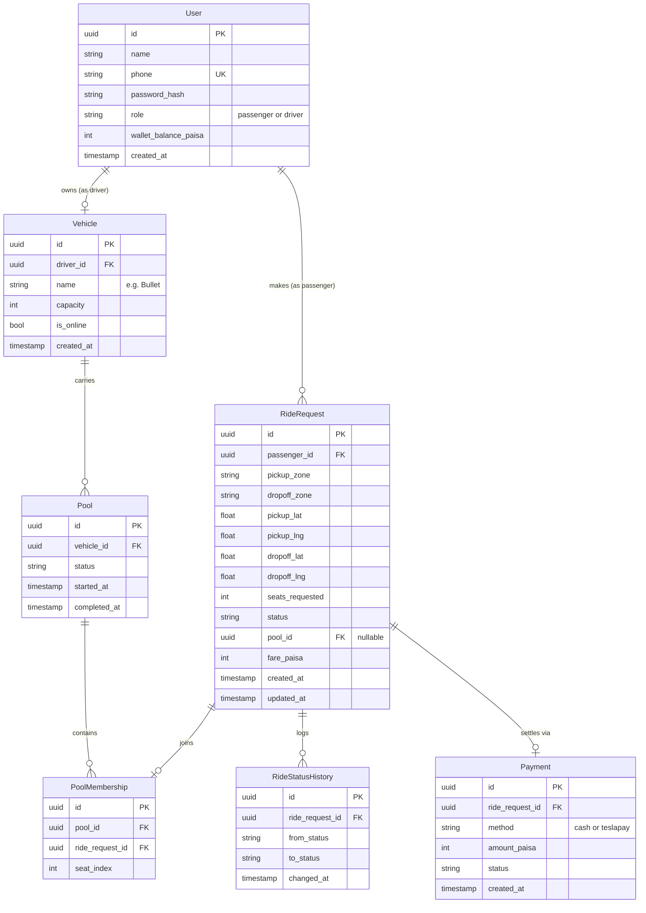

# Database Schema

## ERD

## Table notes

**User**: `role` is a simple enum (`passenger`, `driver`). One table for both roles keeps auth in one place; a driver additionally owns exactly one `Vehicle` for this MVP (one Tesla per driver, matching the Jashim/Bullet pairing in the brief).

**Vehicle**: `capacity` is fixed per vehicle (Bullet = 3). `is_online` gates whether the driver receives new ride requests.

**RideRequest**: `pool_id` is nullable because a request starts unpooled (`REQUESTED`) and may or may not end up sharing a vehicle. `status` is a string constrained by the application-level state machine in `common/status-machine.ts`, not a DB enum, so adding a status later is a one-line change, not a migration that touches an enum type.

**Pool**: represents one shared trip in Bullet. Created when the first request is matched or accepted; additional requests join via `PoolMembership` until capacity is reached.

**PoolMembership**: the join table that enforces "occupied seats never exceed capacity." A unique constraint on `(pool_id, ride_request_id)` prevents double-joining, and the seat-count check happens inside the transaction described in `specs.md`.

**RideStatusHistory**: append-only audit log. Every status transition writes a row here, which is what lets you answer "explain exactly what happened" after a ride completes, per the brief's Section 2.

**Payment**: one row per ride, `method` and `status` are simple strings (`pending`, `completed`, `failed`) since there is no real payment gateway in the MVP.

## Constraints and indexes

- `User.phone`: unique index, used for login lookup.
- `Vehicle.driver_id`: unique (one vehicle per driver in this MVP).
- `RideRequest.passenger_id`, `RideRequest.pool_id`: indexed, used for "my rides" and "pool passengers" queries.
- `PoolMembership (pool_id, ride_request_id)`: unique composite index, prevents duplicate membership and doubles as the fast lookup for "how many seats are taken."
- `RideStatusHistory.ride_request_id`: indexed, used to render a ride's timeline.
- All monetary columns (`wallet_balance_paisa`, `fare_paisa`, `amount_paisa`) are integers, not floats or decimals, storing paisa so no rounding error ever accumulates. One taka equals 100 paisa.

## Why a join table instead of a foreign key on RideRequest alone

`RideRequest.pool_id` tells you which pool a request belongs to, but `PoolMembership` is what lets you enforce and query seat occupancy cleanly (count rows, lock rows) without scanning every ride request in the table. It also gives you a natural place to store `seat_index` if you ever want deterministic seat assignment.
