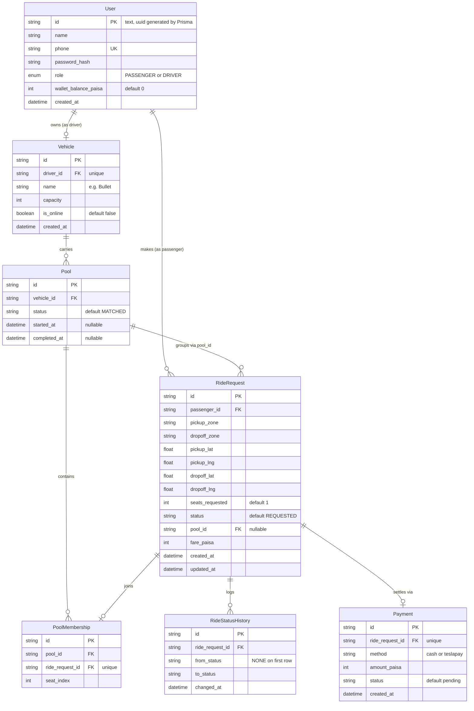

# Database Schema

## Model to table map

Prisma models are PascalCase and singular. The physical PostgreSQL tables are `snake_case` and plural, via `@@map(...)`. Queries written by hand in SQL must use the table names.

| Prisma model | Table | Primary purpose |
|---|---|---|
| `User` | `users` | Passengers and drivers (one table, `Role` enum) |
| `Vehicle` | `vehicles` | A driver's rickshaw and its fixed capacity |
| `RideRequest` | `ride_requests` | One passenger's request, its status and fare |
| `Pool` | `pools` | One shared trip in one vehicle |
| `PoolMembership` | `pool_memberships` | Which ride requests belong to which pool |
| `RideStatusHistory` | `ride_status_history` | Append-only audit log of ride status changes |
| `Payment` | `payments` | One settlement per ride |

## ERD


```mermaid
erDiagram
    User ||--o{ RideRequest : "makes (as passenger)"
    User ||--o| Vehicle : "owns (as driver)"
    Vehicle ||--o{ Pool : "carries"
    Pool ||--o{ RideRequest : "groups via pool_id"
    Pool ||--o{ PoolMembership : "contains"
    RideRequest ||--o| PoolMembership : "joins"
    RideRequest ||--o{ RideStatusHistory : "logs"
    RideRequest ||--o| Payment : "settles via"

    User {
        string id PK "text, uuid generated by Prisma"
        string name
        string phone UK
        string password_hash
        enum role "PASSENGER or DRIVER"
        int wallet_balance_paisa "default 0"
        datetime created_at
    }
    Vehicle {
        string id PK
        string driver_id FK "unique"
        string name "e.g. Bullet"
        int capacity
        boolean is_online "default false"
        datetime created_at
    }
    RideRequest {
        string id PK
        string passenger_id FK
        string pickup_zone
        string dropoff_zone
        float pickup_lat
        float pickup_lng
        float dropoff_lat
        float dropoff_lng
        int seats_requested "default 1"
        string status "default REQUESTED"
        string pool_id FK "nullable"
        int fare_paisa
        datetime created_at
        datetime updated_at
    }
    Pool {
        string id PK
        string vehicle_id FK
        string status "default MATCHED"
        datetime started_at "nullable"
        datetime completed_at "nullable"
    }
    PoolMembership {
        string id PK
        string pool_id FK
        string ride_request_id FK "unique"
        int seat_index
    }
    RideStatusHistory {
        string id PK
        string ride_request_id FK
        string from_status "NONE on first row"
        string to_status
        datetime changed_at
    }
    Payment {
        string id PK
        string ride_request_id FK "unique"
        string method "cash or teslapay"
        int amount_paisa
        string status "default pending"
        datetime created_at
    }
```

## Column types

- IDs are `TEXT`, generated as UUID strings by Prisma (`@default(uuid())`) in the application, not by the database. They are not the native Postgres `uuid` type.
- Timestamps are `TIMESTAMP(3)` (millisecond precision, no time zone). Treat them as UTC.
- `pickup_lat`, `pickup_lng`, `dropoff_lat`, `dropoff_lng` are `DOUBLE PRECISION`.
- `ride_requests.updated_at` is `NOT NULL` with no database default. Prisma fills it in the client (`@updatedAt`), so hand-written SQL inserts must supply it.
- `Role` is a real Postgres enum. Ride, pool and payment `status` columns are deliberately plain `TEXT`, validated in application code (`common/status-machine.ts`), so adding a status is a code change, not an enum migration.

## Table notes

**User**: one table for both roles keeps auth in one place. A driver owns at most one `Vehicle` (unique `driver_id`), matching Jashim and Bullet. `wallet_balance_paisa` exists for the simulated TeslaPay wallet but nothing debits or credits it yet (see Known gaps).

**Vehicle**: `capacity` is fixed per vehicle (Bullet = 3). `is_online` gates whether the driver can accept rides (`PoolsService.accept` rejects offline vehicles). There is no plate or registration column yet.

**RideRequest**: `pool_id` is null until a driver accepts the request. `fare_paisa` is a single integer: it holds the solo quote at creation, and is overwritten with the final fare when the ride is accepted into a pool. The fare breakdown (base, distance, discount) is not stored, only the total. `pickup_lat/lng` and `dropoff_lat/lng` are currently supplied by the client and used to compute distance.

**Pool**: one shared trip. Created by the first accept for a vehicle, then reused while its status is `MATCHED`. Pool status follows the same lifecycle strings as rides (`MATCHED`, `DRIVER_ARRIVED`, `STARTED`, `COMPLETED`) through the same status machine. A pool has no `CANCELLED` state.

**PoolMembership**: one row per ride request in a pool. It is written on accept, but capacity is currently counted through `ride_requests.pool_id`, not through this table (see Known gaps). `seat_index` is set to the number of requests already in the pool, so it is a join order, not a physical seat number, and does not account for multi-seat requests.

**RideStatusHistory**: append-only audit log, one row per ride status change. The first row for a ride records `from_status = 'NONE'` at creation. `'NONE'` is not in the status machine's transition map, and that row is written directly, not through `assertTransition()`. Pool-level transitions write one history row per member ride, and there is no separate pool history table.

**Payment**: at most one row per ride (`ride_request_id` unique). The schema default for `status` is `'pending'`, but `PaymentsService.charge()` always writes `'completed'`, so `'pending'` is never observed. There is no failure path: cash and simulated TeslaPay succeed immediately. `PoolsService.complete()` currently always passes method `'cash'`.

## Foreign keys

All foreign keys are `ON DELETE RESTRICT ON UPDATE CASCADE`, except `ride_requests.pool_id`, which is `ON DELETE SET NULL`. Nothing in the MVP deletes rows, so this only matters for manual clean-up: you cannot delete a user, vehicle, pool or ride that still has dependent rows.

## Constraints and indexes

Enforced by the database:

| Name | Columns | Purpose |
|---|---|---|
| `users_phone_key` | `users(phone)` unique | Login lookup, no duplicate accounts |
| `vehicles_driver_id_key` | `vehicles(driver_id)` unique | One vehicle per driver |
| `ride_requests_passenger_id_idx` | `ride_requests(passenger_id)` | "My rides" |
| `ride_requests_pool_id_idx` | `ride_requests(pool_id)` | "Passengers in this pool", seat counting |
| `pools_vehicle_id_idx` | `pools(vehicle_id)` | Find a vehicle's open pool |
| `pool_memberships_ride_request_id_key` | `pool_memberships(ride_request_id)` unique | A ride request can be in at most one pool |
| `pool_memberships_pool_id_ride_request_id_key` | `(pool_id, ride_request_id)` unique | Redundant with the constraint above, but its leading `pool_id` also serves lookups by pool |
| `ride_status_history_ride_request_id_idx` | `ride_status_history(ride_request_id)` | Render a ride's timeline |
| `payments_ride_request_id_key` | `payments(ride_request_id)` unique | One payment per ride |

The database has no `CHECK` constraints. These rules are enforced only in application code: capacity is positive, seats requested is between 1 and capacity, money is non-negative, and status values are valid.

## How capacity and consistency are enforced today

Capacity is not a database constraint. It is enforced inside a single Prisma transaction in `PoolsService.accept()`:

1. Find the vehicle's pool with status `MATCHED` (a stale read, used only to learn the pool id).
2. `SELECT ... FOR UPDATE` on that `pools` row, so a concurrent accept for the same vehicle blocks until this transaction commits or rolls back.
3. Re-read the pool's ride requests after the lock is held, then check pickup-zone compatibility and `seatsTaken + seatsRequested <= capacity`.
4. Update the ride, insert the membership, insert the history row, all in the same transaction.

So the scenario in the brief (Bullet has one seat left, Nusrat and Shirin claim it together) is serialized by the pool row lock: the second transaction re-reads after the first commits and is rejected with 409.

At larger scale this becomes a hot row per vehicle. Options would be a per-vehicle seat counter updated with a conditional `UPDATE ... WHERE seats_taken + n <= capacity`, or moving matching to a single writer per geographic shard.

## Money

All money columns (`wallet_balance_paisa`, `fare_paisa`, `amount_paisa`) are `INTEGER` paisa. 100 paisa = 1 taka. Integers avoid float rounding drift, and `FareService` rounds once, to the nearest paisa, at the end of the calculation. Postgres `INTEGER` is 32-bit, so the maximum is 2,147,483,647 paisa (about ৳21.47 million). That is ample for fares, but switch wallet balances to `BIGINT` if larger totals are ever possible.

## Seed data

`backend/prisma/seed.ts` is idempotent (`upsert`) and creates the story cast. Every user has the demo password `password123`.

| Person | Role | Phone | Notes |
|---|---|---|---|
| Jashim | DRIVER | 01700000000 | Owns Bullet (capacity 3), seeded online |
| Nusrat | PASSENGER | 01700000001 | Wallet balance 0 |
| Rafiq | PASSENGER | 01700000002 | Wallet balance 0 |
| Shirin | PASSENGER | 01700000003 | Wallet balance 0 |

The seed creates users and the vehicle only. It does not create ride requests or pools, so the Nusrat, Rafiq and Shirin scenario is played through the app or the API.

## Migration status

The schema is applied via `backend/prisma/migrations/20260926120000_init/migration.sql`, generated with `npx prisma migrate dev`. It is the only migration. `docker-compose.yml`'s `api` service runs `npx prisma migrate deploy` on startup, which applies existing migration files and never generates new ones. Any schema change needs a new migration created locally with `npx prisma migrate dev --name <description>` and committed together with the `schema.prisma` change.

## Known gaps

These describe current behavior that differs from the intent of the design. Remove an entry when its fix lands.

1. **Cancelling a `MATCHED` ride does not release its seat.** `RidesService.cancel()` sets the status to `CANCELLED` but leaves `pool_id` and the membership row in place. The cancelled ride is still counted toward capacity, and `PoolsService.transitionPool()` will throw 409 when it reaches the cancelled member, which blocks the whole pool from advancing.
2. **The first rider in a pool keeps the solo fare.** The pooled discount is applied only when a ride joins a pool that already has members. Nusrat, accepted first, is never recalculated when Rafiq joins, so only Rafiq gets the discount.
3. **Two open pools can exist for one vehicle.** The lock only protects an existing `MATCHED` pool. Two concurrent first accepts can each create a pool, and once a pool reaches `DRIVER_ARRIVED` the next accept no longer finds it and creates another. No constraint prevents this.
4. **A ride can be accepted twice concurrently.** `ride.status` is checked outside the transaction and the update has no status guard. The unique index on `pool_memberships.ride_request_id` aborts the loser, but it surfaces as a database error, not a clean 409.
5. **Seat counting reads `ride_requests.pool_id`, not `pool_memberships`.** Both are written, so there are two sources of truth for pool membership.
6. **Ride creation and cancellation are not atomic.** The ride row and its history row are separate writes, outside a transaction.
7. **Payments run after the pool transition commits**, outside its transaction. A failure partway through leaves a completed pool with some rides unpaid. The wallet balance is never debited, and only `cash` is ever written.
8. **Client-supplied coordinates.** A client can send a zone name with mismatched coordinates. The fare is computed from the coordinates.
9. **No `plate` column**, although the UI shows a vehicle plate.

Proposed hardening, not yet applied. Partial indexes need a hand-edited migration (`npx prisma migrate dev --create-only`, then edit the SQL):

```sql
-- One open pool per vehicle (fixes gap 3)
CREATE UNIQUE INDEX pools_one_open_per_vehicle
  ON pools (vehicle_id)
  WHERE status IN ('MATCHED', 'DRIVER_ARRIVED', 'STARTED');

ALTER TABLE vehicles      ADD CONSTRAINT vehicles_capacity_positive   CHECK (capacity > 0);
ALTER TABLE ride_requests ADD CONSTRAINT ride_requests_seats_positive CHECK (seats_requested > 0);
ALTER TABLE ride_requests ADD CONSTRAINT ride_requests_fare_nonneg    CHECK (fare_paisa >= 0);
ALTER TABLE users         ADD CONSTRAINT users_wallet_nonneg          CHECK (wallet_balance_paisa >= 0);
```
