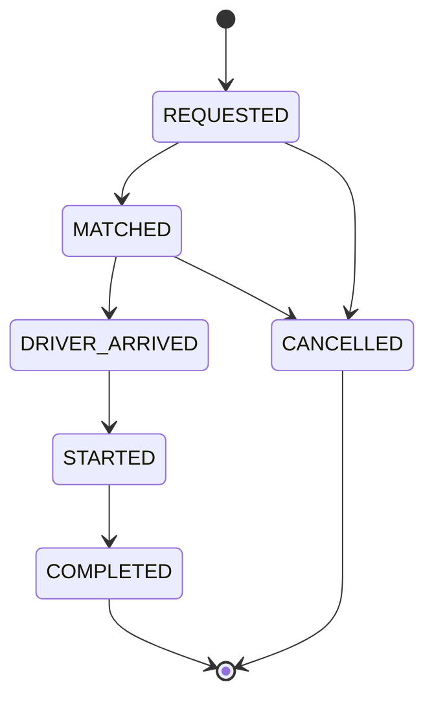

# Specifications

This document defines the rules the system enforces: which zones exist, when riders can share a vehicle, how fares are calculated, how a ride moves through its lifecycle, and how the system stops two riders from taking the same last seat.

The rules here describe the current code. Fare constants live in `backend/src/fare/fare.constants.ts` and the zone table in `backend/src/geo/zones.data.ts`. If you change a rule, update this file in the same commit.

The examples use the demo cast: Jashim drives Bullet, a rickshaw with 3 seats, and Nusrat, Rafiq and Shirin are passengers.

## Zones

Pickup and destination are chosen from eight predefined Dhaka zones. There is no map provider. Each zone has a fixed centre point, and the distance between two zones is the straight line (haversine) distance between those centres. It is an estimate for fares, not a route.

| Zone | Latitude | Longitude | Adjacent zones |
|---|---|---|---|
| Banani | 23.7937 | 90.4066 | Gulshan, Mohakhali |
| Gulshan | 23.7925 | 90.4078 | Banani, Mohakhali, Bashundhara |
| Mohakhali | 23.7806 | 90.4074 | Banani, Gulshan, Farmgate |
| Dhanmondi | 23.7461 | 90.3742 | Farmgate, Mirpur |
| Mirpur | 23.8223 | 90.3654 | Dhanmondi, Uttara |
| Uttara | 23.8759 | 90.3795 | Mirpur |
| Farmgate | 23.7580 | 90.3897 | Mohakhali, Dhanmondi |
| Bashundhara | 23.8146 | 90.4344 | Gulshan |

Adjacency is symmetric: if Banani is adjacent to Gulshan, Gulshan is adjacent to Banani. Riders never send coordinates. The server looks them up from the zone names.

## Pooling rules

A driver accepts ride requests one at a time. A ride can join the driver's pool only when all of these hold:

1. The driver's vehicle is online.
2. The ride is in `REQUESTED` status and is not already in a pool.
3. The ride's pickup zone is compatible with the pickup zone of every ride already in the pool.
4. The ride's dropoff zone is compatible with the dropoff zone of every ride already in the pool.
5. The seats already taken plus the seats this ride requests do not exceed the vehicle's capacity.

Two zones are compatible when they are the same zone or adjacent to each other. Nothing more is checked: there is no bearing calculation and no route planning.

A vehicle adds riders only to a pool that is still in `MATCHED` status. After the driver marks the pool as arrived, further accepts start a separate pool.

A request can ask for 1 to 3 seats, and capacity is counted in seats, not in riders.

**Example.** Nusrat wants Banani to Mohakhali and Rafiq wants Banani to Gulshan. Their pickup zone is the same, and Mohakhali and Gulshan are adjacent, so Jashim can pool them in Bullet. That uses 2 of the 3 seats. A rider going from Uttara to Mirpur cannot join that pool, because Uttara is not adjacent to Banani. Jashim gets a `409` if he tries.

## Fares

All amounts are integer paisa, and 100 paisa equals 1 taka.

```
rawFare       = baseFare + (distanceKm * perKmRate)
poolDiscount  = pooled ? rawFare * 0.20 : 0
passengerFare = round(rawFare - poolDiscount)
```

| Constant | Value |
|---|---|
| Base fare | 3000 paisa (BDT 30) |
| Rate per km | 1500 paisa (BDT 15) |
| Pool discount | 20% |

The fare is rounded once, at the very end, to the nearest paisa. A value exactly halfway rounds up. Money never stays a fraction past that point.

Each rider pays for their own distance, so pooling is a discount on the rider's own trip, not a split of one shared fare. The fare does not depend on how many seats a request asks for.

**When a fare is set.**

- At creation, a ride is quoted at the solo fare.
- When a driver accepts a ride into a pool that already has riders, that ride gets the pooled fare, and every rider already in the pool is recalculated to the pooled fare using their own route.
- A rider who is alone in a pool keeps the solo fare until someone else joins.
- When a pool is completed, one cash payment is recorded per active ride for the ride's current fare. Cancelled rides are not charged.

### Worked example

Both trips start in Banani, so you can check them by hand with the table above.

| Rider | Trip | Distance | Solo fare | Pooled fare | Saved |
|---|---|---|---|---|---|
| Nusrat | Banani to Mohakhali | 1.459 km | 5188 | 4151 | 1037 |
| Rafiq | Banani to Gulshan | 0.181 km | 3271 | 2617 | 654 |

The arithmetic for Nusrat:

```
rawFare = 3000 + (1.4589 * 1500) = 5188.39      solo fare: 5188
pooled  = 5188.39 - (5188.39 * 0.20) = 4150.71  pooled fare: 4151
```

Together the two riders save 1691 paisa (BDT 16.91). Banani and Gulshan are close together, so Rafiq's fare is barely above the base fare.

## Lifecycle



Statuses are uppercase strings and are shown to users exactly as written. The complete transition table is in [api-contracts.md](api-contracts.md#status-lifecycle). Any move outside it is rejected with `409`, and every check goes through one shared function in `backend/src/common/status-machine.ts`.

- **Cancellation** is only possible while a ride is `REQUESTED` or `MATCHED`. Once the driver has arrived, a passenger can no longer cancel.
- **A pool follows the same statuses** except that it cannot be cancelled. The driver moves the whole pool, and every active ride in it moves together. Each ride must also be allowed to make that move, otherwise the whole transition is refused.
- **Cancelled riders** stay in the pool's history. They do not block the pool from advancing, and they are not charged.
- **A pool can only start** if it contains at least one ride.
- **History.** Every status change writes a row to an append-only history table. The first row for a ride records the move from `NONE` to `REQUESTED`.

## Concurrency: the last seat

**The problem.** Bullet has one free seat. Two ride requests are accepted at almost the same instant. Both readers see "1 seat free" before either one has written anything, and both would succeed. The vehicle would end up over capacity.

**The solution.** Accepting a ride runs inside a single database transaction:

1. Find the vehicle's pool in `MATCHED` status. This first read may be stale, and it is only used to learn the pool's id.
2. Lock that pool's row, so any other accept for the same vehicle waits.
3. Read the pool's rides again, now that the lock is held. This read sees everything committed before it.
4. Check compatibility and check that `seatsTaken + seatsRequested <= capacity`.
5. Update the ride, recalculate fares, write the membership and history rows, and commit. Committing releases the lock.

The lock is a plain Postgres row lock:

```sql
SELECT id
FROM "pools"
WHERE id = $1
FOR UPDATE;
```

The second transaction proceeds only after the first commits. It then sees the seat is gone and fails with `409 Vehicle capacity would be exceeded`. Exactly one rider gets the seat.

### What the lock does and does not cover

- **Covered:** concurrent accepts into the same existing pool. Capacity is never exceeded by them.
- **Not covered: a vehicle with no pool yet.** If two accepts arrive at the same moment for a vehicle that has no pool in `MATCHED` status, each can create its own pool, because there is no row to lock. No database constraint currently prevents this. A partial unique index on open pools would close the gap. The proposed SQL is in [database-schema.md](database-schema.md).
- **Same ride accepted twice.** A unique index on the membership table stops the second write, and the API turns that into `409 This resource was already claimed by another request`.
- **Cancelled rides still count.** Capacity is computed from every ride linked to the pool, including cancelled ones. A cancelled ride keeps its seat in the capacity check.

### Verification

The unit tests for accepting rides cover the capacity arithmetic (including an exact fit), pickup and dropoff compatibility against every member, fare recalculation, and that the row lock query is issued. They run with the database mocked. There is not yet an automated test that runs two accepts at the same time against a real Postgres instance, so the race protection itself rests on the design above and is not yet proven by an automated test.

### At larger scale

The pool row becomes a hot row under heavy load on a single vehicle. The options, in order of effort:

- Keep a seat counter on the vehicle and claim seats with a conditional update, `UPDATE ... WHERE seatsTaken + n <= capacity`, and treat zero rows changed as "full".
- Add a `version` column and use optimistic concurrency, retrying or failing fast when the version changed.
- Process seat claims through a single worker per vehicle or per geographic area. This removes lock contention, at the cost of extra latency and infrastructure.

None of these is needed at the current scale.
