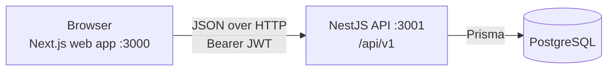

# Tech Stack

Dhaka Tesla Pool is a TypeScript project with a NestJS API, a Next.js web app and a PostgreSQL database. Everything runs locally with Docker Compose. The project is not deployed anywhere yet.

## How the pieces fit

The web app talks to the API with plain `fetch` calls and a JWT in the `Authorization` header. The API owns all business rules and is the only component that touches the database. For the endpoints, see [api-contracts.md](api-contracts.md).

## Backend

| Concern | Choice | Why |
|---|---|---|
| Runtime | Node.js 20 | Current LTS line, and the version used by both Docker images. |
| Language | TypeScript 5 | One language across API and web app, with typed DTOs and service return types. |
| Framework | NestJS 10 (Express platform) | Modules, dependency injection and guards keep controllers thin and business logic in services. |
| Database access | Prisma 5 | Typed queries, and migrations that are committed alongside the schema. |
| Validation | `class-validator` and `class-transformer` | Every request body is a DTO. A global `ValidationPipe` strips undeclared fields and rejects unknown ones with `400`. |
| Authentication | `@nestjs/jwt`, Passport (`passport-jwt`) and `bcrypt` | Passwords are hashed with bcrypt. A signed JWT carries the user id and role, and a roles guard enforces passenger and driver routes. |
| Configuration | `@nestjs/config` | Environment variables, validated at startup. |
| Testing | Jest, `ts-jest` and Supertest | Unit tests per service, plus end to end tests against a real database for concurrency. |

### Authentication details

Access token only. There is no refresh flow. A token is valid for 1 day by default, and the lifetime is set with the `JWT_EXPIRES_IN` environment variable. Tokens are signed with `JWT_SECRET`.

### Concurrency control

A vehicle has a fixed number of seats, and two riders can try to claim the last one at the same moment. Accepting a ride runs inside a single database transaction that takes a Postgres row lock on the vehicle's open pool (`SELECT ... FOR UPDATE`). The second request waits, re-reads the pool after the first one commits, and is rejected with `409` if the seat is gone. This keeps the rule in one place and needs no extra infrastructure such as a queue or an external lock service.

## Frontend

| Concern | Choice | Why |
|---|---|---|
| Framework | Next.js 16 (App Router) | File based routing, with route groups separating the auth, passenger and driver areas. |
| UI library | React 19 | Required by the current Next.js. |
| Language | TypeScript | Frontend types mirror the API's JSON contract directly, with no casing conversion layer. |
| Styling | Tailwind CSS 4 | Utility classes driven by CSS variables for light and dark themes. |
| Motion | `motion` | Bottom sheets and expanding rows, with reduced motion respected. |
| Icons | `lucide-react` | Consistent line icons. |
| Font | Geist | Ships with the Next.js ecosystem, no external font requests. |
| Package manager | pnpm | Declared in `package.json`. |

The web app has no state management or data fetching library. A small API client wraps `fetch`, and a React context holds the signed in user. The JWT is kept in the browser's `localStorage` and sent as a Bearer header.

## Data

| Concern | Choice | Why |
|---|---|---|
| Database | PostgreSQL | Transactions and row level locks, which the seat capacity rule depends on. |
| Money | Integer paisa | Avoids floating point drift. Fares are rounded once, at the end of the calculation. |
| Status values | Plain text, checked in code | Adding a status is a code change, not a database enum migration. |

The full schema is in [database-schema.md](database-schema.md).

## Infrastructure

| Concern | Choice | Why |
|---|---|---|
| Local environment | Docker Compose with three services: `api`, `web` and `postgres` | One command starts the whole stack. The `api` service applies committed migrations on startup. |
| Images | Multi stage Dockerfiles on `node:20-alpine` | Dependencies, build and runtime are separate stages, so the runtime image carries only what it runs. |
| Health checks | `GET /api/v1/health` | Answers only when the API can reach the database, so a container is not reported healthy while Postgres is still starting. |
| Hosting | None yet | The project has not been deployed. |

Default ports are 3000 for the web app and 3001 for the API.

## Deliberate simplifications

These are choices made to keep the scope small, not oversights.

- **No map provider.** Pickup and destination are chosen from eight predefined Dhaka zones with fixed coordinates. Distances are straight line estimates. Only the `geo` module would change if a real routing service were added.
- **No real payment gateway.** Payments are recorded as simulated cash settlements. Only the `payments` module would change to add a gateway.
- **No refresh tokens.** Users sign in again when a token expires.
- **Fares are formula based.** There is no surge or dynamic pricing. Only the `fare` module would change to add one.

The three swap points (`geo`, `fare`, `payments`) are described in [architecture.md](architecture.md).
